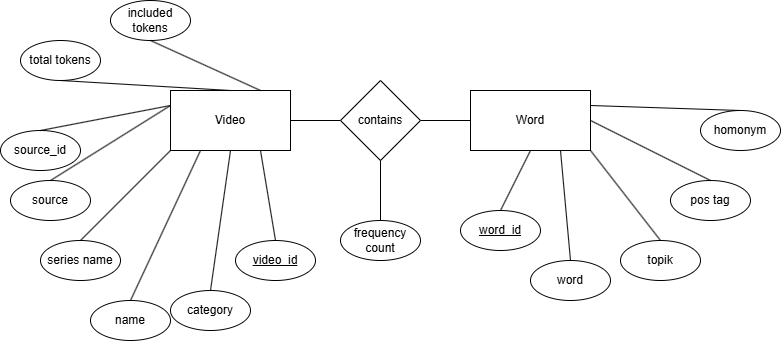

# 🗂️ Korean Subtitles Linguistic Database (v0.1)

This project is a proof-of-concept pipeline and database for processing Korean subtitle files (`.srt`) into a structured format suitable for linguistic analysis. The system uses part-of-speech tagging via KoNLPy and stores both raw and processed token data in an SQLite database. The long-term developmental goal for the project is to improve and optimize finding appropriate media for comprehnsible input for language learners of Korean (and later other languages too).

---

## 📌 Table of Contents

- [Overview](#overview)
- [Project Structure](#project-structure)
- [Requirements](#requirements)
- [Installation](#installation)
- [Usage](#usage)
- [Database Schema & ER Diagram](#database-schema--er-diagram)
- [Manual Grading & Annotation](#manual-grading--annotation)
- [Reproducibility Notes](#reproducibility-notes)
- [Packaging & Releases](#packaging--releases)
- [Future Work](#future-work)
- [License](#license)

---

## 🔍 Overview

This project allows for ingesting Korean `.srt` subtitle files, performing morphological analysis, converting data to JSON format, and inserting tokenized information into an SQLite database. It was developed for use in linguistic research and educational settings where corpus data is valuable but tools may be limited.

The pipeline supports:
- Subtitle to JSON parsing
- POS tagging with `Okt` from KoNLPy
- Manual annotation support
- Batch insertions into a structured database
- Output reporting & summaries

The code and structure are optimized for reproducibility, modularity, and ease of manual inspection.

---

## 📁 Project Structure
```
.
├── README.md
├── kr_er.png # Entity Relationship diagram of the DB schema
├── requirements.txt # Dependencies
├── raw/ # Original .srt subtitle files
├── json/ # Intermediate JSON outputs (tokenized, lemmatized, pos tagged)
├── aux_data/ # Reference files like TOPIK word lists, etc.
├── src/
│ ├── build_database.py # initialize and populate db in one cmd
│ ├── sql/ directory for query commands and views
│ ├── pipeline/ # Scripts for SRT parsing, tagging, annotation
│ │ ├── srt_to_json.py # actually runs konlpy okt on srt 
│ │ ├── annotate_output.py # read parsed json to manually grade it in interactive shell
│ │ ├── resume_annotations.py # pick up where you left off with annotations
│ │ └── report_annotations.py # output score summary of annotated jsonfile
│ └── database/ # Database schema creation & insertion logic
│ ├── init_db.py # create database with schema
│ ├── schema.sql
│ ├── insert_words.py # insert topik words into database 
│ ├── process_tokens.py # puts tokens from processed json into db
│ └── clean_topik_data.py # util used to clean topik word lists
└── releases/
└── v0.1/ # Optional: GitHub release downloadables (e.g. DB file)
```


---

## 📦 Requirements

- Python ≥ 3.8
- `pysrt`
- `konlpy`
- `pandas`
- `sqlite3` (standard library)

---

## 🔧 Installation

1. Clone this repository:
   ```bash
   cd subtitle-studytool
   ```

2. Create a virtual environment (recommended):
   ```bash
      python -m venv venv
      source venv/bin/activate
   ```

3. Install dependencies
   ```bash
      pip install -r requirements.txt
   ```


4. Build database
   ```bash
      cd src/
      python build_database.py
   ```


## 🚀 Usage
### how to (manually) insert parsed words from json into the database:
first in the sqlite shell, add the video entry:
```
INSERT INTO Videos (video_name, category)
VALUES ('[BTS VLOG] RM | 미술관 VLOG', 'YouTube');
```

get the video id of newly added entry:
```
SELECT video_id, video_name 
FROM Videos WHERE video_name = '[BTS VLOG] RM | 미술관 VLOG';
```

then in the cmd line, run the script to add the words and get the summary:
```
~/subtitle-studytool/src/database$ python process_tokens.py ../../json/BTS_VLOG_RM_미술관.jsonl --db korean_vocab.db --video-id 1
=== SUMMARY ===
Processed file:         BTS_VLOG_RM_미술관.jsonl
Total tokens:           2462
Matched tokens:         1132
Ignored tokens:         706
Unmatched tokens:       624
Video ID:               1
WordFrequency updated:  447 words
Logs saved:             ignored_tokens_BTS_VLOG_RM_미술관.txt, unmatched_tokens_BTS_VLOG_RM_미술관.txt
```


## 📊 Database Schema & ER Diagram
The database schema is designed around word-level tokens, linked to subtitle files and individual sentence contexts.

Below is the ER diagram representing the database schema:



Schema:
```
Words(
    word_id INTEGER PRIMARY KEY AUTOINCREMENT,
    word TEXT NOT NULL,
    pos_tag TEXT NOT NULL,
    topik_level INTEGER NOT NULL,
    homonym BOOLEAN DEFAULT 0,
    guide TEXT,
    UNIQUE(word, pos, level, guide)
)
Videos(
    video_id INTEGER PRIMARY KEY AUTOINCREMENT,
    video_name TEXT NOT NULL,
    series_name TEXT,
    category TEXT,
    source_id TEXT
    source TEXT
)
WordFrequency(
    word_id INTEGER,
    video_id INTEGER,
    frequency INTEGER DEFAULT 1,
    PRIMARY KEY (word_id, video_id),
    FOREIGN KEY (word_id) REFERENCES Words(word_id),
    FOREIGN KEY (video_id) REFERENCES Videos(video_id)
)
```

Word table is built on official topik word lists.
- total of 10635 words are labeled 1급-6급 across 6 files
- these files downloaded from [kleocean](https://kleocean.com/토픽-어휘-topik-vocab/)
- files from kleocean for topik I and II lists were passed up for containing only 1847 and 3873 words respectively and only labeling words as 초/중 not 1-6
- file from [국립국어원](https://www.korean.go.kr/front/etcData/etcDataView.do?mn_id=46&etc_seq=71&pageIndex=21) were passed up for scoring words by A/B/C only and for containing only 5966 words. (this resource does contain hanja in addition to pos tagging though)
- english pos column is added when inserted to database, new word_id is created to be key, and usage column is eliminated


## 🧠 Manual Grading & Annotation
Some files have been manually reviewed and annotated for tagging accuracy and morphological validity. Annotations can be resumed, saved, and reported via:

resume_annotations.py

report_annotations.py

These tools help validate tokenizer and POS tag performance.

#### current accuracy:
```
📊 Annotation Report for True_Beuty_ep1_annotated.jsonl
Total lines annotated: 140/953 (14.7%)
Correct (✅):     105 (75.0%)
Incorrect (❌):   35 (25.0%)
Skipped (⏭):     0 (0.0%)

📊 Annotation Report for BTS_VLOG_RM_미술관_annotated.jsonl
Total lines annotated: 169/410 (41.2%)
Correct (✅):     128 (75.7%)
Incorrect (❌):   38 (22.5%)
Skipped (⏭):     3 (1.8%)
```


## 🔁 Reproducibility Notes
The project is designed for reproducibility. All steps from raw data ingestion to final database population can be executed via scripts. You can:

Clear and reinitialize the database at any time

Add new .srt files without overwriting existing ones

Use file suffixes (e.g., json.done or srt.don) to track completed steps


## 📦 Packaging & Releases
An SQLite database file (.db) is included in Releases for demonstration purposes. You can download it directly without needing Python setup.

Future versions may include a GUI or standalone executable for non-technical users.

Desktop apps like [sqlitebrowser](https://sqlitebrowser.org/) (full sql desktop app) or [sqliteviewer](https://sqliteviewer.app/) (web-based app for viewing) can be used to explore the database comfortably outside a command line interface.


## 📌 Future Work
Improve automation for bulk video processing

Increase dataset size (more dramas, YouTube, etc.)

Add CLI for better interaction

Add NLP metrics / linguistic summary tools

Deploy a basic web viewer for queries


